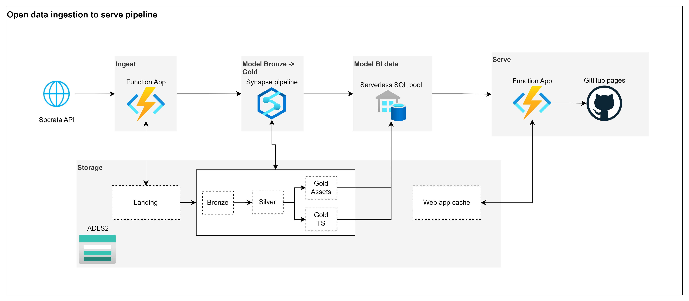

# Dashboard to visualize key metrics from Colombia's open data (Socrata)

Dashboard developed in vanilla JS, HTML, CSS to visualize key information available in Colombia's open data Socrata catalog. 

[cristiandsh.github.io/colodata-dash/](https://cristiandsh.github.io/colodata-dash/)

## Functionality

Weekly stats including:

- Views and downloads weekly trend.
- Most viewed and downloaded assets.
- Views and downloads weekly trend by category.
- New and removed assets trend.
- Assets composition by type.
- Assets composition by category.

## Limitations

- Lowest grain by design is weekly. A lower grain can be achieved simply by triggering ingestion more frequently.
- Description returned by Socrata's API has a 4000 characters limit. Any Description longer than that comes truncated.
- Standard and anonymous API users only have access to retrieve public datasets. This dashboard is fed by calling the API as anonymous user, then private assets are not fetched or displayed.

## Data pipeline

This dashboard is served by a data pipeline deployed entirely with Azure services.

Goals:

- Model data so that it is easy to get valuable information of assets week by week.
- Model data so that views, downloads and changes in metadata can be tracked.
- Spend the least amount of resources and money.

### Ingestion

Ingestion is done by calling Socrata API for Colombia's domain (?domains=datos.gov.co). It is called in a weekly basis, which marks the granularity for this dashboard as well. Ingestion happens with this high level steps:

- Synapse triggers the Azure function
- The Azure function makes a GET request to the Socrata catalog API api.us.socrata.com/api/catalog/
- The same Azure function saves the response as a JSON file into an Azure Data Lake Storage account v2.

#### Challenges during ingestion

- Socrata API can only return a maximum of 1,000 resources per call while Colombia open data got around 30,000 resources. To solve this limitation, the scroll id functionality of the Socrata's catalog API was used. It requires to keep memory of the last resource id returned and pass it as argument to a next call. This involved making consecutive calls until no new assets are returned from the API.

### Model Bronze -> Gold

This high level step takes data from the landing zone until modelling it into a gold stage. Gold stage is split into 2: Assets gold (which tracks changes in assets metadata) and Time Series gold (which tracks views and downloads count per asset per week). It is comprised roughly by these steps:

- Read landing zone data and enrich the JSON document with a hash of each list parameter. e.g column names, categories, parent assets.
- Read enriched JSON files and normalize them in a table structure.
- Add row hashes to each row to identify distinct records.
- Build assets gold table as an SCD2 with deleted assets track.
- Build time series gold table for views and downloads.

#### Challenges during modelling

- Socrata's response parameters which are lists, are returned unordered and inconsistently. One day it might return [a,b] and the next [b,a]. This would affect any naive attempt to hash a resource to detect changes. To solve this issue, the raw response from Socrata is later enriched to add a hash to each response parameter which is a list. When hashing later to identify distinct records, the raw lists parameters are ignored, and their hashed version is used instead.
- Azure Synapse SQL Pools don't have complete support to handle columns with JSON objects. This makes reading maps and hashing them challenging with Synapse's SQL flavor. To make development easier, Azure Functions were used instead to read Socrata's raw response, adding the hash of the lists parameters and saving the result as an additional JSON file.

### Model BI modelling

BI modelling has the purpose of reading gold stage data and build the tables that finally feed the dashboard.

#### Challenges during BI modelling
- Not much of a challenge, but important to mention is that Socrata's API only returns cumulative views and downloads count. To get the weekly counts, a lag difference needs to be done.

### Serve

Serving is done via Azure functions. A single API call is defined to fetch all the BI tables built in the previous steps. It caches results for 22 hours. The logic is comprised by these steps:

- Dashboard makes a call via JS script to Azure function app.
- Azure function checks in ADLS if cached response exceeded 22 hours.
- If 22 hours were exceeded, it fetches data from Synapse serverless SQL pool and overwrites cached response.
- If 22 hours were not exceeded, it reads and returns cached response.

#### Challenges during serving

- Serving was planned initially with FastAPI, however, with the free Azure web app plan the app is shut down after 20 mins idle and it takes a long time to cold start. As the objective was to use the least amount of resources and money, Azure functions was finally chosen to serve the BI. This change didn't affect performance or complexity at all given the simplicity of the API.